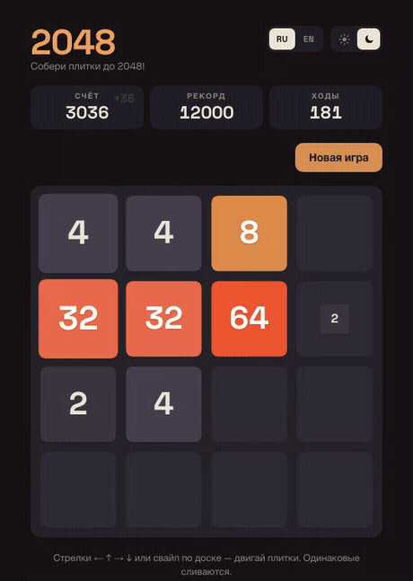
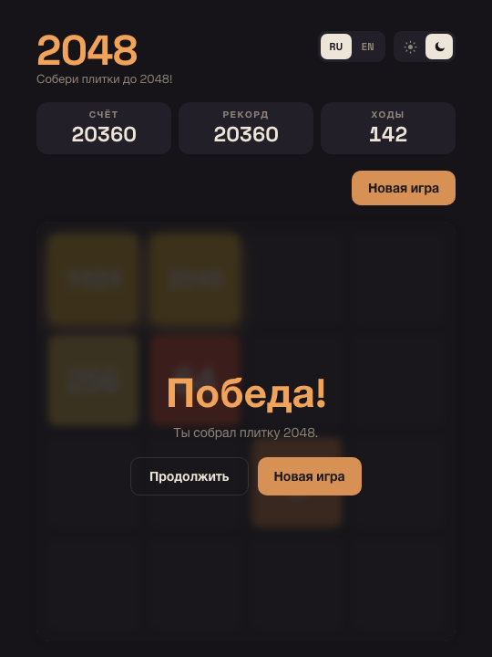
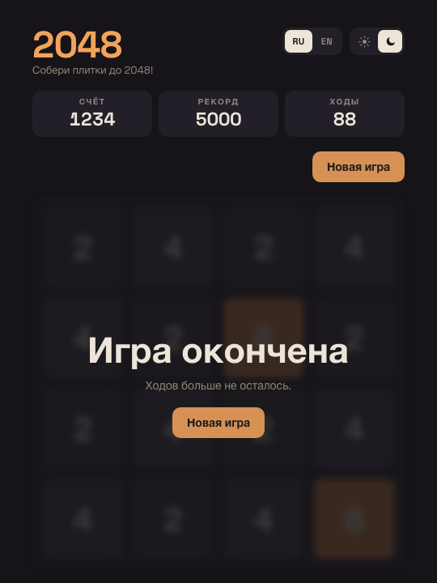
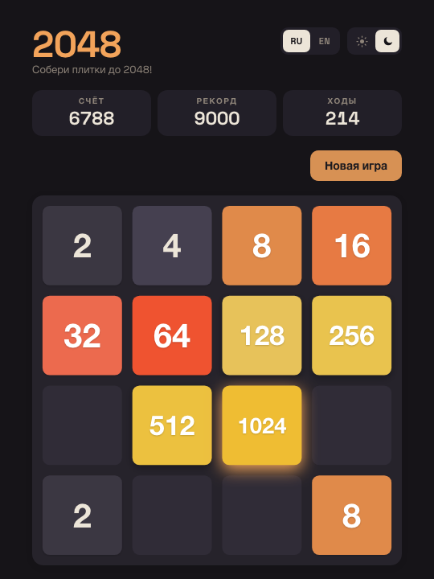
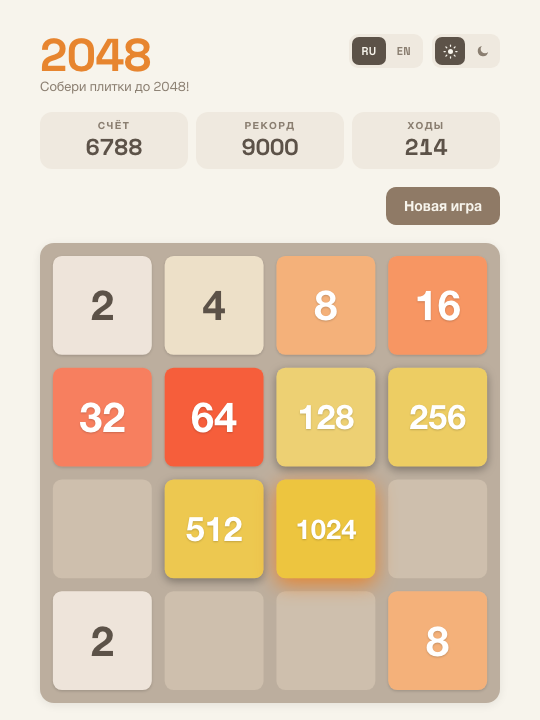

# 2048

> Браузерная реализация головоломки **2048** на TypeScript и Canvas 2D — без единого
> UI-фреймворка. Пет-проект как витрина инженерной культуры: архитектура, чистый
> рендеринг, типобезопасность и тесты на нарочито минимальном стеке.

[](https://www.typescriptlang.org/)
[](https://vitejs.dev/)
[](https://vitest.dev/)
[](https://playwright.dev/)
[](https://feature-sliced.design/)

**▶ Демо:** https://julfy-bs.github.io/2048/

<p align="center">
  
</p>

## Оглавление

- [О проекте](#о-проекте)
- [Правила игры](#правила-игры)
- [Темы и язык](#темы-и-язык)
- [Возможности](#возможности)
- [Технологии](#технологии)
- [Архитектура](#архитектура)
- [Интересные технические решения](#интересные-технические-решения)
- [Тестирование](#тестирование)
- [Структура проекта](#структура-проекта)
- [Управление](#управление)
- [Запуск и команды](#запуск-и-команды)
- [Зоны роста](#зоны-роста)
- [Лицензия](#лицензия)

## О проекте

Игра работает полностью на клиенте: доска, плитки и анимации рисуются на `<canvas>`,
а интерфейс вокруг (счёт, кнопки, переключатели, оверлеи) собран из семантического
DOM. Нет бэкенда, фреймворков и runtime-зависимостей.

Цель — не «просто рабочая игра», а образец того, как выглядит аккуратная кодовая база:
чистая логика отделена от рендеринга, правила игры — чистые тестируемые функции,
рендеринг разбит на слои, а состояние живёт в одном месте и валидируется на входе.

## Правила игры

- Двигай плитки стрелками (или **W A S D**) либо свайпом — все плитки едут в выбранную
  сторону до упора.
- Две одинаковые плитки при столкновении **сливаются** в одну с удвоенным значением
  (не более одного слияния на плитку за ход).
- Каждый ход в свободной клетке появляется новая плитка: **2** с шансом 90%, **4** — 10%.
- Собери плитку **2048** — это победа; можно остановиться или продолжить дальше.
- Если ходов не осталось — игра окончена.

<p align="center">
  
  &nbsp;
  
</p>

## Темы и язык

Тема по умолчанию берётся из системной настройки и переключается одной кнопкой; язык —
русский или английский. Всё сохраняется между сессиями. Основной вид — тёмная тема,
но есть и светлая:

<p align="center">
  
  &nbsp;
  
</p>

## Возможности

- **Canvas-рендеринг с анимациями.** Поле и плитки рисуются на Canvas 2D; ход
  проигрывается движком на `requestAnimationFrame`: сдвиг, появление новой плитки с
  лёгким overshoot, «пульс» слияния и мягкое свечение крупных плиток.
- **Светлая и тёмная темы** с переключателем; по умолчанию — по системной настройке.
- **Два языка** — русский и английский, все строки вынесены в i18n-словарь.
- **Счёт, рекорд и счётчик ходов**; всё сохраняется между сессиями.
- **Сохранение прогресса** в `localStorage` — доска, счёт, рекорд, ходы, тема и язык
  восстанавливаются после перезагрузки. Сохранённые данные валидируются: битый снимок
  не роняет игру, а откатывается к чистому состоянию.
- **Управление** с клавиатуры (стрелки и WASD) и свайпами (мышь, тач). Ввод
  блокируется на время анимации хода, поэтому быстрый спам не ломает картинку.
- **Экраны победы и поражения** с размытием фона; после 2048 можно продолжить игру.
- **Адаптивность** от 320px до десктопа и поддержка `prefers-reduced-motion`.

## Технологии

| Область         | Выбор                                 | Почему                                                  |
| --------------- | ------------------------------------- | ------------------------------------------------------- |
| Язык            | TypeScript (strict)                   | Типобезопасность без `any` / `as` / `!`                 |
| Рендеринг       | Canvas 2D API                         | База для 2D-игр, полный контроль над кадром             |
| Сборка          | Vite                                  | Быстрый dev-сервер и единый инструмент (сборка + тесты) |
| Архитектура     | Feature-Sliced Design                 | Явные слои и правила зависимостей                       |
| Юнит/интеграция | Vitest + jsdom                        | Быстрые тесты логики и вью                              |
| E2E             | Playwright                            | Проверка реальных сценариев в браузере                  |
| Качество кода   | ESLint, Prettier, husky + lint-staged | Автолинт и формат на pre-commit                         |
| Деплой          | GitHub Pages (`gh-pages`)             | Статический хостинг без бэкенда                         |

Никаких runtime-зависимостей: игра — это чистый TypeScript и Web API.

## Архитектура

Проект следует [Feature-Sliced Design][fsd] с соблюдением правил зависимостей, импортов
и публичного API (слайс подключается через свой `index.ts`).

```
shared      → config, i18n (ru/en), lib (storage, dom), types
entities/   → board: чистая логика — grid, move, rules, spawn
features/   → game: движок состояния (model) + вью (ui)
app/        → стили и дизайн-токены
index.ts    → композиционный корень: собирает движок и вью
```

Рендеринг **гибридный**: игровое поле с плитками — на Canvas (там нужна быстрая
покадровая перерисовка), а вся «обвязка» — счёт, кнопки, переключатели темы и языка,
модальные оверлеи — в DOM. Так поле остаётся на своей естественной технологии, а
интерфейс получает доступность, семантику и CSS-переходы без ручной эмуляции на канве.

Ключевой шов — **инъекция рендерера**: вью зависит не от конкретного `BoardRenderer`,
а от интерфейса `BoardRendererLike`. В продакшене подставляется canvas-рендерер, в
тестах — заглушка, поэтому вью монтируется в jsdom без настоящего `<canvas>`.

## Интересные технические решения

**Один алгоритм на четыре направления.** Ход — это «схлопывание линии» к краю плюс
отображение координат под направление (`READERS` в [move.ts](src/entities/board/lib/move.ts)).
Никакого копипаста «вверх/вниз/влево/вправо» — одна функция и таблица преобразований.

**Чистое ядро отделено от анимации.** `planMove` — чистая функция: принимает плитки и
направление, возвращает перемещения, слияния, набранные очки и итоговые плитки. Никаких
таймеров и мутаций, поэтому логика полностью детерминирована и покрыта юнит-тестами.
Тайминги и `requestAnimationFrame` живут во вью, а не в правилах.

**Canvas-движок анимаций.** [board-renderer.ts](src/features/game/ui/board-renderer.ts)
интерполирует позиции плиток по фазам (сдвиг → слияние/появление → покой) с easing
(`easeOutBack` для overshoot, синус для «пульса»), рисует скруглённые плитки, тени и
свечение. Цвета он читает из тех же CSS-переменных, что и DOM, — единый источник токенов.

**Блокировка ввода на время хода.** `animateMove` возвращает `Promise`, а вью держит
флаг `animating`: пока кадр не досчитан, новые ходы игнорируются. Это чинит порчу
анимации при быстром спаме управления.

**Недоверенное хранилище.** Чтение из `localStorage` проходит через валидацию формы
([storage.ts](src/shared/lib/storage.ts)): распарсили — проверили каждое поле — при
любом несовпадении вернули `null` и стартовали чистую игру. Повреждённый сейв не
«кирпичит» игру.

**Композиция вместо наследования.** Движок (`GameEngine`) держит состояние и
применяет ходы синхронно; вью получает движок через конструктор, а не наследует его.
Детерминированный спавн (выбор из списка свободных клеток, с инъекцией источника
случайности) делает и эту часть тестируемой.

## Тестирование

Три уровня, каждый на своём инструменте:

- **Юнит** (Vitest) — чистые правила: схлопывание/слияние линии, победа/поражение,
  выбор клетки спавна, накопление очков, валидация хранилища.
- **Интеграционные** (Vitest + jsdom) — вью вместе с движком: ход с клавиатуры меняет
  DOM, работает счётчик ходов, срабатывает блокировка ввода, переключаются тема и язык
  (рендерер подменён заглушкой).
- **E2E** (Playwright) — реальные сценарии в браузере: новая игра, ход, победа,
  поражение, сохранение темы после перезагрузки, смена языка и устойчивость к спаму.

```bash
npm test          # юнит + интеграционные
npm run test:e2e  # E2E
```

## Структура проекта

```
src/
├─ app/styles/            # дизайн-токены и стили (tokens, base, game)
├─ shared/
│  ├─ config/             # размер поля, геометрия, тайминги
│  ├─ i18n/               # словари ru/en
│  ├─ lib/                # storage (валидируемый), dom-хелпер
│  └─ types/              # доменные типы
├─ entities/board/        # чистая логика: grid, move, rules, spawn
├─ features/game/
│  ├─ model/              # GameEngine — состояние и правила
│  └─ ui/                 # board-renderer (canvas) + game-view (DOM)
└─ index.ts               # композиционный корень
e2e/                      # Playwright: сценарии и генерация скриншотов
scripts/                  # запись demo.gif
```

## Управление

- **← ↑ → ↓** или **W A S D** — двигать плитки;
- **свайп** по доске — то же на тач-устройствах и мышью.

## Запуск и команды

```bash
npm install       # установка зависимостей
npm run dev       # дев-сервер Vite
npm run build     # проверка типов + продакшен-сборка в dist/
npm run preview   # предпросмотр собранной версии
npm test          # юнит и интеграционные тесты
npm run test:e2e  # E2E-тесты
npm run lint      # ESLint
npm run format    # Prettier
npm run deploy    # сборка и публикация на GitHub Pages
```

## Зоны роста

Осознанный бэклог — куда проект может расти дальше:

- **Отмена хода (undo)** — история состояний уже почти есть в снимках; не хватает стека.
- **Поле произвольного размера** (5×5, 6×6) — размер уже вынесен в конфиг единой точкой.
- **Цепочки анимаций** — подсветка каскадных слияний, «след» сдвига для крупных плиток.
- **PWA / офлайн** — манифест, service worker и самохостинг шрифта Space Grotesk
  (сейчас он подгружается из Google Fonts).
- **Доступность игрового поля** — ARIA-live-регион, который проговаривает изменения
  доски для скринридеров (canvas сам по себе не озвучивается).
- **Таблица рекордов** — при желании: лёгкий бэкенд или serverless-функция.
- **Детерминированные партии** — сид генератора для воспроизводимых раскладов и реплеев.
- **CI/CD** — GitHub Actions: линт, тесты и E2E на PR, автодеплой на Pages.
- **Производительность** — перерисовка только изменившихся клеток (dirty-rect) в
  горячем пути.

## Лицензия

ISC. Автор — [Богдан Сутужко][author-github].

Игра вдохновлена оригинальным [2048][2048-game] Габриэле Чирулли.

[2048-game]: https://github.com/gabrielecirulli/2048
[fsd]: https://feature-sliced.design
[author-github]: https://github.com/julfy-bs
